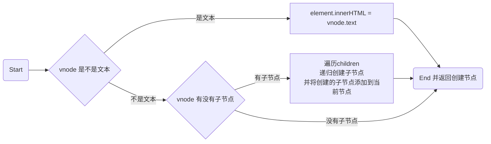
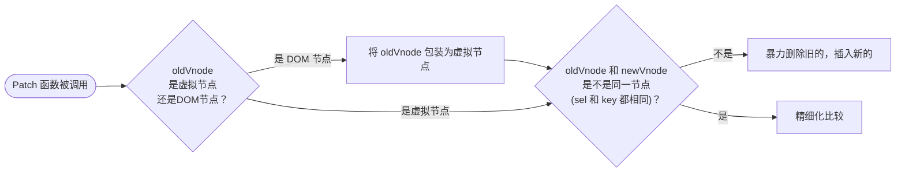
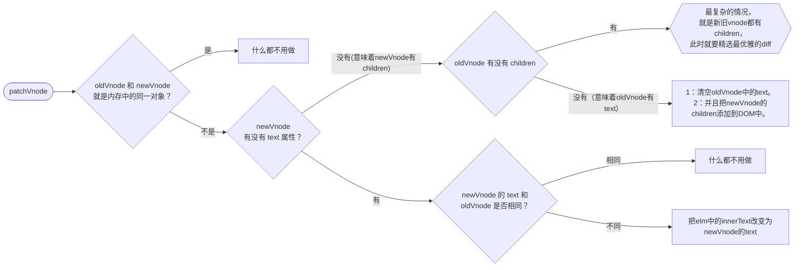
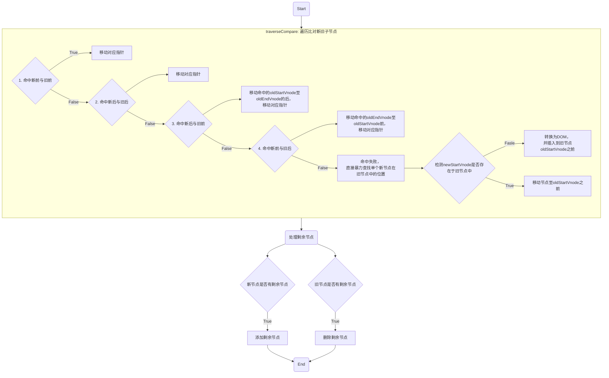
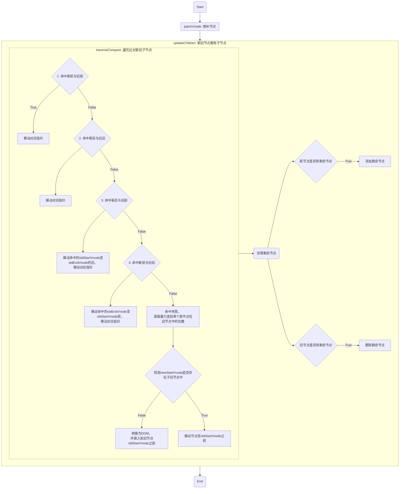

# SimpleSnabbdom

[snabbdom](https://github.com/snabbdom/snabbdom)| [simple-snabbdom](https://github.com/langnang/simple-snabbdom)

## vnode

```puml
left to right direction
class Node{
  tagName
  innerText
  others
}
class Vnode{
  sel: String
  data: <Object Attributes>
  children: <Array Vnode>
  text: String
  elm: <DOM>
  key: String
}

Node::tagName --> Vnode::sel
Node::innerText --> Vnode::text
Node::others --> Vnode::data
```

## h

根据传参的个数以及类型，动态生成虚拟 DOM

**示例**

```javascript
h("div", {}, "文字");
```

```json
{
  "sel": "div",
  "data": {},
  "text": "文字"
}
```

```javascript
h("ul", {}, []);
```

```json
{
  "sel": "ul",
  "data": {},
  "children": []
}
```

```javascript
h("ul", {}, h());
```

```json
{
  "sel": "ul",
  "data": {},
  "children": [
    {
      "sel": "li",
      "data": {},
      "text": "文字"
    }
  ]
}
```

## createElement



**示例**

```javascript
createElement(h("div", {}, "文字")).nodeType === 1;
// true
createElement(h("ul", {}, [])).nodeType === 1;
// true
createElement(h("ul", {}, h("li", {}, "文字"))).nodeType === 1;
// true
```

## patch

修补节点



**示例**

```javascript
const example01 = h("div", {}, "文字");
const example02 = h("ul", {}, []);
const example03 = h("ul", {}, h("li", {}, "文字"));
patch(container, example01);
patch(container, example03);
```

## patchVnode



**示例**

```javascript
const example01 = h("div", {}, "文字");
const example02 = h("ul", {}, []);
const example03 = h("ul", {}, h("li", {}, "文字"));
patch(container, example01);
patch(container, example03);
```

## updateChildren

新旧节点都有子节点的情况下，diff 更新新旧子节点

**语法**

```js
updateChildren(newChildren, oldChildren, parent);
```




